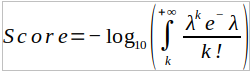

```{r setup, include=FALSE}
knitr::opts_chunk$set(echo = TRUE)
```

We want to fit the number of annotated records (hits) e.g. of SNPs to a Poisson distribution model. To do that we consider that a SNP has `k` hits and `lambda` is the fitted parameter of the corresponding Poisson model, then the score of the SNP is defined as follows:



```{r}
# Poisson term is 1 - CDF(k-1,lambda) 
# i.e. right tail is 1 minus left tail of distribution
score = function(k,lambda){
  return( -1*log10(1-ppois(k-1,lambda)) )
}
```

```{r}
score(k = 15, lambda = 10)
```


